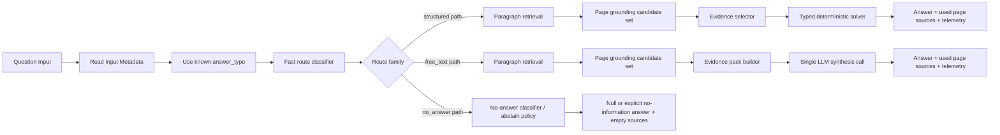
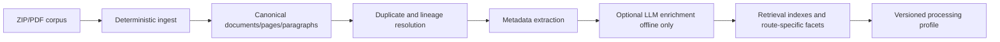

# ADR 2026-03-06: Winning Runtime North Star v1

## Контекст
Мы строим систему под конкурс, где итоговый результат определяется не общей "умностью агента", а функцией:

- `S` — answer score
- `G` — grounding score
- `T` — telemetry completeness
- `F` — TTFT factor

Из конкурсных ограничений и текущего ТЗ следуют ключевые факты:

- source на конкурсе всегда page-level;
- paragraph-level chunking можно использовать внутри, но экспорт и grounding остаются page-level;
- preprocessing time не входит в runtime evaluation;
- TTFT включает routing и внутренние шаги;
- public set смещен в structured questions, а free-text не должен диктовать всю архитектуру;
- no-answer path является обязательным, а не edge case.

Нам нужен не просто runtime, а North Star для всех будущих решений: что считать правильным направлением системы, а что считать отклонением.

## Решение
Принимаем в качестве North Star следующую архитектурную концепцию:

1. Система должна быть **offline-heavy, online-light**.
2. На runtime мы должны **максимально избегать лишних online LLM calls**.
3. Основное ветвление runtime делается не по "LLM-intent first", а по:
   - входному `answer_type`, если он уже известен;
   - быстрому route classification на `route_family`.
4. Structured questions должны идти в **deterministic-first path**.
5. Free-text path допускает **максимум один основной LLM synthesis call** на строго управляемом evidence pack.
6. Retrieval unit = paragraph, competition source unit = page, final answer context unit = evidence pack.
7. No-answer является отдельным route/solver path.
8. Любое существенное изменение runtime должно входить в **versioned runtime profile** и проверяться через experiments/compare.
9. Этот ADR является не только описанием идеи, но и **decision filter**: новые runtime-решения должны явно проверяться на соответствие этому документу.

## North Star

### Core Thesis
Победная система переносит максимум сложности в preprocessing и canonicalization, а runtime делает коротким, предсказуемым и измеримым.

### Runtime Flow

### Offline Flow

## Route Lattice and Solver Policy

| Answer type | Preferred path | LLM policy | Primary output mode | Fallback |
| --- | --- | --- | --- | --- |
| `boolean` | deterministic typed solver | avoid online LLM | normalized boolean + page sources | no-answer or bounded free-text only if evidence is ambiguous |
| `number` | deterministic typed solver | avoid online LLM | normalized numeric answer + page sources | no-answer if extraction is not grounded |
| `date` | deterministic typed solver | avoid online LLM | normalized date + page sources | no-answer if date candidates conflict |
| `name` | deterministic typed solver | avoid online LLM | single canonical entity + page sources | no-answer if entity cannot be uniquely grounded |
| `names` | deterministic typed solver | avoid online LLM | ordered or policy-normalized list + page sources | no-answer if list completeness is not defensible |
| `free_text` | controlled synthesis path | one main online LLM call max | short grounded synthesis + page sources | abstain if evidence pack is insufficient |

Route family должен определять не "понимание смысла", а operational handling:

- `article_lookup`
- `single_case_extraction`
- `cross_case_compare`
- `cross_law_compare`
- `history_lineage`
- `no_answer`

Внутри runtime комбинация `answer_type + route_family` должна однозначно выбирать profile, retrieval strategy и solver path.

## Обязательные архитектурные правила

### 1. Не делать обязательный online LLM intent classification
Если `answer_type` уже приходит из конкурсного input, он должен использоваться напрямую.

Следствие:
- routing online должен быть быстрым и deterministic-first;
- первый LLM call не должен быть default step.

### 2. Route family важнее абстрактного "intent"
На практике runtime должен выбирать не "мы поняли вопрос", а конкретный operational path:

- `article_lookup`
- `single_case_extraction`
- `cross_case_compare`
- `cross_law_compare`
- `history_lineage`
- `no_answer`

### 3. Structured first, free-text second
Приоритет runtime:

1. typed deterministic solver;
2. no-answer path;
3. controlled free-text synthesis.

Это означает:
- нельзя строить архитектуру вокруг большого универсального LLM answerer;
- free-text — это fallback для конкретных route families, а не default engine.

### 4. Granular context control
В системе должны существовать три явно разные сущности:

- `paragraph chunk` — unit of retrieval;
- `page` — unit of grounding/export;
- `evidence pack` — unit of solver/LLM input.

Нельзя смешивать их роли.

### 5. Offload intelligence to preprocessing
Раз preprocessing time не считается, туда нужно переносить:

- duplicate grouping;
- lineage resolution;
- article/law/case references;
- entities, dates, money, section hints;
- optional offline LLM enrichment.

Runtime должен пользоваться уже подготовленной структурой, а не заново "думать" о документе.

### 6. Presets = versioned runtime profiles
То, что интуитивно воспринимается как "пресеты", в системе должно жить как versioned profiles:

- retrieval profile
- solver profile
- scorer policy
- prompt policy
- corpus processing profile

Нельзя держать ключевые решения только в голове или в ad-hoc flags.

### 7. No-answer path обязателен как first-class citizen
No-answer не должен быть побочным продуктом плохого retrieval.

Он должен иметь:
- отдельные thresholds;
- отдельные regression suites;
- отдельную оценку precision/recall.

### 8. Evidence pack является отдельным контрактом
Evidence pack нельзя собирать ad hoc внутри final prompt builder.

Он должен иметь стабильные правила:
- максимум контекста задается profile-политикой, а не локальной эвристикой;
- каждый paragraph внутри evidence pack должен быть обратимо связан с page source;
- selector должен явно различать `retrieved candidates` и `used evidence`;
- evidence pack должен быть достаточно компактным, чтобы не ухудшать TTFT без measurable quality win.

## Alternative Considered

### A. General LLM-first agent
Идея: сначала LLM понимает вопрос, планирует, ищет, потом отвечает.

Почему отвергнуто:
- TTFT дороже;
- сложнее воспроизводимость;
- выше риск неявной деградации grounding;
- structured questions решаются неоптимально дорого.

### B. LLM intent call before every answer
Идея: всегда делать быстрый intent classification через LLM.

Почему отвергнуто как default:
- лишний online call входит в TTFT;
- `answer_type` уже известен на входе;
- route family часто можно определить быстрее правилами и metadata.

### C. Large page-only chunks
Идея: использовать страницу как retrieval chunk.

Почему отвергнуто:
- хуже точность поиска;
- сложнее granular context control;
- больше шум в final context pack.

## Consequences

### Что становится проще
- лучше контролируется TTFT;
- лучше контролируется grounding;
- проще сравнивать profiles;
- structured path легче покрывать regression tests;
- легче держать no-answer discipline.

### Что становится сложнее
- ingest и canonicalization становятся важнее и сложнее;
- retrieval и evidence selection требуют аккуратной настройки;
- нужны versioned profiles и experiments discipline;
- нужен отдельный evidence-pack layer.

### Migration / Rollback
- migration path: двигаться от bootstrap runtime к route-specific deterministic-first runtime;
- rollback path: держать baseline profile с минимальным числом online LLM steps;
- любое отклонение от этого North Star должно быть сознательным и измеренным.

## North Star Review Checklist
Любое заметное решение по runtime должно проверяться вопросами:

1. Переносит ли это решение работу offline, если это возможно?
2. Добавляет ли оно лишний online LLM call?
3. Улучшает ли оно structured path раньше, чем free-text path?
4. Сохраняет ли оно page-level grounding/export semantics?
5. Разделены ли paragraph retrieval, page grounding и evidence pack?
6. Есть ли отдельный no-answer behavior, а не неявный fallback?
7. Зафиксировано ли это в versioned profile/policy?
8. Можно ли измерить влияние через compare against baseline?

Если на 2, 4, 6 или 8 ответ "нет", решение должно считаться подозрительным до дополнительной проверки.

## Как использовать этот ADR

Этот документ должен использоваться как North Star, а не как разовая заметка.

Обязательные правила применения:

1. Каждый новый runtime/spec/eval plan должен либо соответствовать этому ADR, либо явно описывать, где и почему он от него отклоняется.
2. Любая задача, затрагивающая routing, retrieval, evidence selection, solver choice, no-answer или prompt policy, должна проверяться по `North Star Review Checklist`.
3. Любое осознанное отклонение допускается только при наличии измеримого выигрыша против baseline по contest-like метрикам.
4. Если решение не может быть объяснено через `offline-heavy, online-light` логику, оно считается suspect до отдельного review.

Практический смысл:
- этот ADR фильтрует идеи до реализации;
- этот ADR фильтрует изменения до merge;
- этот ADR фильтрует гипотезы до массового эксперимента.

## Governance and Re-evaluation

North Star должен переоцениваться по событию, а не по настроению.

Минимальные точки переоценки:

- после появления contest starter kit и первых public runs;
- после каждого крупного изменения scoring interpretation;
- после каждого существенного route-level regression по `S`, `G`, `T` или `F`;
- перед freeze на private phase.

Формат переоценки:

1. Что осталось верным в текущем ADR.
2. Что перестало быть верным и на каких данных это видно.
3. Какие решения теперь считаются допустимыми отклонениями.
4. Нужен ли version bump North Star.

## Когда переоценивать North Star
Этот документ не является догмой. Его нужно переоценивать, если:

- организаторы меняют правила scoring или export;
- public/private data показывает, что route lattice неполна;
- оказывается, что structured share существенно ниже ожидаемой;
- second online LLM call доказывает measurable win без unacceptable TTFT hit;
- preprocessing assumptions не выдерживают качества реального корпуса.

До появления таких сигналов этот документ считается guiding architecture note для runtime.

## Action Items Derived From This ADR

- [ ] Зафиксировать enum или policy-registry для `route_family`, чтобы runtime, eval и reports говорили на одном языке.
- [ ] Зафиксировать versioned runtime profiles для retrieval, evidence selection, solvers и prompt policy.
- [ ] Описать и зафиксировать evidence pack contract как отдельную source-of-truth сущность.
- [ ] Построить deterministic-first paths для `boolean`, `number`, `date`, `name`, `names`.
- [ ] Построить отдельный no-answer path с собственными thresholds и regression suites.
- [ ] Развести в telemetry и reports `retrieved candidates` и `used evidence`.
- [ ] Добавить contest-like compare slices по `answer_type`, `route_family`, `no-answer`, `grounding`, `TTFT`.
- [ ] Для каждого нового runtime task/spec добавить проверку на соответствие `North Star Review Checklist`.
